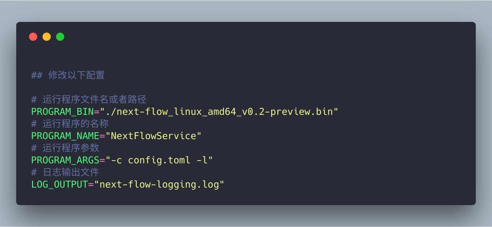

# 汇集自用脚本文件

## 1. 服务端程序运行控制脚本

> 用于控制服务端程序的运行状态，核心是使用nohup命令来运行程序。

本脚本用于打包程序的运行命令和参数，提供 `start`、`stop`、`status`等控制命令。

### Usage

下载`service.sh`文件，修改其文件前部分的配置信息。

运行命令：

> $ chmod +x ./service.sh
> $ ./service.sh start